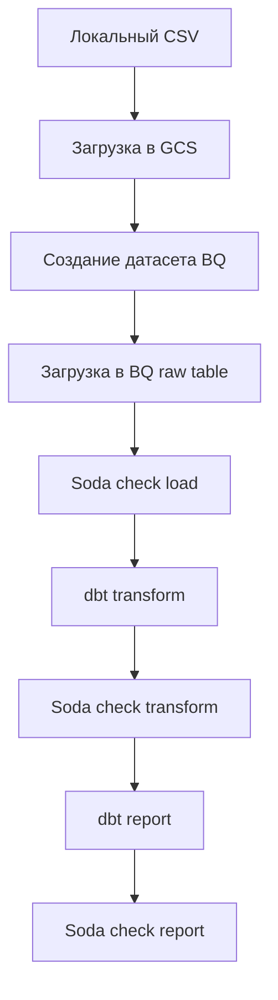

# Retail ETL

Проект демонстрирует ETL‑пайплайн для интернет‑розницы на основе Airflow. 

## Стек
- **Airflow** – оркестрация выполнения задач.
- **Astro SDK** – загрузка файлов и работа с BigQuery из Airflow.
- **Cosmos** – интеграция dbt‑моделей в Airflow.
- **dbt** – трансформации и построение отчетных витрин.
- **Soda** – проверки качества данных.
- **Google Cloud Storage / BigQuery** – хранилище и DWH.

## Схема пайплайна

## Описание процесса
1. **Загрузка CSV в GCS** — исходный файл `online_retail.csv` переносится в бакет.
2. **Создание датасета BigQuery** — создается схема `retail`.
3. **Загрузка сырых данных** — `astro.aql.load_file` переносит CSV в таблицу `raw_invoices`.
4. **Soda проверка загрузки** — первичный контроль качества.
5. **dbt трансформация** — Cosmos запускает модели `models/transform`.
6. **Soda проверка трансформации** — контроль качества после трансформаций.
7. **dbt отчёт** — выполняются модели `models/report`.
8. **Soda финальная проверка** — завершающий контроль данных.
